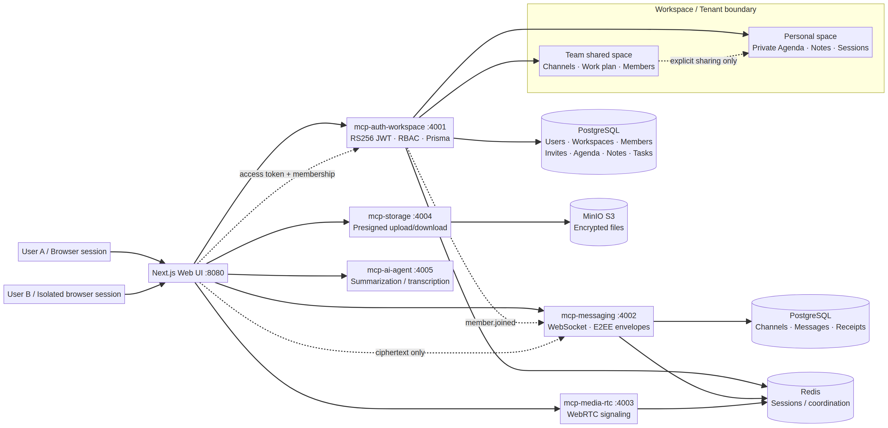

# OpenTeams — Technical Review & Delivery Report

## 1. Executive summary

هذا التقرير مبني على مراجعة الكود الموجود فعلياً والـpromptين المرفقين، وليس على وصف نظري. المشروع عنده monorepo بـpnpm/Turbo، واجهة Next.js، وخدمات Fastify/MCP للمصادقة وWorkspace والرسائل والمكالمات والتخزين والـAI. تم تشغيل فحوص فعلية على المشروع، وتم تسجيل الإصلاحات والنتائج أدناه.

التقييم الواقعي للـprompt الأخير هو **حوالي 60% منجز**. السبب أن البنية الأساسية والـWorkspace والـchat والأمان الأولي موجودة، وتمت إضافة Agenda/Notes وPlan de travail وWorkspace invites، لكن الـprompt يطلب أيضاً إثباتات security قابلة لإعادة الإنتاج، Dashboard/Profile كاملين، real-time member events، وPlaywright E2E كامل بحسابين فعليين. هذه النقاط الأخيرة لم تُثبت كلها بعد.

## 2. Architecture



المسار الأساسي هو: المتصفح يتصل بالواجهة، والواجهة تستدعي MCP tools بخدمات منفصلة. `mcp-auth-workspace` هو مصدر الحقيقة للمستخدمين والـWorkspace وRBAC والدعوات وAgenda/Notes/tasks. `mcp-messaging` يدير القنوات والرسائل وWebSocket. `mcp-media-rtc` يدير signaling للمكالمات. `mcp-storage` يدير presigned URLs وMinIO. PostgreSQL يحفظ البيانات المنظمة، Redis مخصص للتنسيق والجلسات، وMinIO للملفات.

العزل المقصود هو أن كل session في متصفح مستقل تستعمل token مختلفاً، وأن الوصول إلى Workspace أو channel يتطلب membership. الحساب الشخصي، Agenda وNotes الخاصة به لا يجب أن تظهر إلا لصاحبها أو لمن منحهم مشاركة صريحة.

## 3. What was implemented

| Area | Files / implementation | Status |
|---|---|---|
| Workspace data | `services/mcp-auth-workspace/prisma/schema.prisma` | User, Workspace, WorkspaceMember, Channel and RBAC models موجودة |
| Agenda | `AgendaEvent`, `EventParticipant`, `AgendaVisibility`, `AgendaPermission` | Personal by default؛ shared/workspace visibility model موجود |
| Notes | `PersonalNote`, `NoteShare` | Private default؛ workspace/share relations موجودة |
| Work plan | `WorkTask`, `TeamTool`, task status/priority enums | Backend model وMCP tools وواجهة أولية موجودة |
| Invite system | `WorkspaceInvite`, invite status, expiry, maxUses | create/accept/list/revoke tools موجودة |
| Member management | list members, update role, remove/leave | RBAC rules موجودة في `invite.tools.ts` |
| Invite route | `apps/web/src/app/invite/[code]/page.tsx` | authenticated accept flow موجود؛ unauthenticated registration prefill مازال ناقصاً |
| Agenda/Notes UI | `AgendaNotesPanel.tsx` | loads and creates real MCP data؛ shared permission UI مازال ناقصاً |
| Work plan UI | `WorkPlanPanel.tsx` | kanban-like status columns and real MCP task calls موجودة |
| Members UI | `WorkspaceMembersPanel.tsx` | real member list, statuses, invite link and pending invites موجودة |
| API client | `apps/web/src/lib/api.ts` | real calls for Agenda, Notes, tasks, tools, invites, members |
| Security baseline | RS256 JWT, issuer/audience checks, rate limiting, panic lock, E2EE envelope types | موجود جزئياً ويحتاج proof tests |
| Build | Next.js `15.5.24`, TypeScript, Turbo | verified clean |

## 4. MCP tools added or used

| Tool | RBAC rule | Frontend caller |
|---|---|---|
| `create_agenda_event` | authenticated; workspace membership if workspace-scoped | `AgendaNotesPanel` |
| `list_agenda_events` | owner, participant, or member of workspace-wide event | `AgendaNotesPanel` |
| `create_note` | authenticated; workspace membership if workspace-scoped | `AgendaNotesPanel` |
| `list_notes` | owner, explicitly shared user, or member for non-private workspace note | `AgendaNotesPanel` |
| `create_work_task` | workspace member; assignee must also be member | `WorkPlanPanel` |
| `list_work_tasks` | workspace member | `WorkPlanPanel` |
| `create_team_tool` | OWNER/ADMIN only | API-ready; management UI not complete |
| `list_team_tools` | workspace member | `WorkPlanPanel` |
| `create_invite` | OWNER/ADMIN only; role cannot be OWNER | `WorkspaceMembersPanel` |
| `accept_invite` | authenticated; validates status, expiry, email and maxUses | `/invite/[code]` |
| `list_workspace_invites` | OWNER/ADMIN only | `WorkspaceMembersPanel` |
| `revoke_invite` | OWNER/ADMIN only | API-ready; revoke UI needs completion |
| `list_workspace_members` | workspace member | `WorkspaceMembersPanel` |
| `update_member_role` | OWNER/ADMIN; owner protected; admin cannot manage another admin | API-ready; settings UI needs completion |
| `remove_member` | admin for others; self-leave allowed; owner protected | API-ready; settings UI needs completion |

## 5. Security review

### 5.1 Verified positively

| Severity | Finding | Fix / current state | Test evidence | Result |
|---|---|---|---|---|
| High | Next.js 14 dependency had public advisories | Updated web dependency and lockfile to Next.js `15.5.24` | `pnpm exec turbo run build --force` showed Next.js 15.5.24 | Fixed for the Next.js path |
| Medium | Prisma Client did not know new Agenda models initially | Regenerated Prisma Client after schema changes | `pnpm --filter @openteams/mcp-auth-workspace db:generate` | Passed |
| High | Invite role escalation risk | Input role excludes OWNER; update rules protect OWNER and restrict ADMIN actions | Typecheck passed; dedicated runtime RBAC test still required | Code guard present, proof pending |
| High | Cross-workspace task assignment risk | `create_work_task` validates creator and assignee membership in same workspace | Typecheck passed; runtime tenant test still required | Code guard present, proof pending |
| Medium | Personal data leakage risk | Agenda/Notes list queries use owner/participant/workspace predicates | Typecheck passed; DB-level isolation test still required | Code guard present, proof pending |

### 5.2 Open security findings

| Severity | Finding | Required next action |
|---|---|---|
| High | `pnpm audit` reports `deepmerge-ts@7.1.5` through Prisma 6.19.3 | Upgrade Prisma to a compatible patched release or use a vendor-supported patch; do not claim fixed with an ignored override |
| High/Moderate | PostCSS advisory paths may remain in transitive packages | Resolve through a supported Next/PostCSS upgrade and rerun audit; verify the lock graph |
| High | No completed proof test for `alg:none` and HS256 confusion | Add forged-token tests against the real verifier and expect rejection |
| High | No completed refresh-token replay/family-revocation proof | Add test that reuses an already-used refresh token and verifies family revocation |
| High | Tenant-isolation proof is incomplete | Run valid Workspace A token against Workspace B channels/messages/files and record 403/404 for every operation |
| High | WebSocket `/ws` and `/ws/call` unauthenticated/expired-token proof incomplete | Add connection tests for no token, invalid token and expired token |
| High | File traversal, oversized file, MIME mismatch and expired presigned URL tests incomplete | Add negative tests against mcp-storage and verify MinIO bucket is not public-read |
| High | Full E2EE ciphertext-only DB proof incomplete | Seed encrypted DM, query DB directly, verify plaintext/private key absence |
| Medium | Production Docker Compose exposes development ports and local credentials patterns | Use internal network, reverse proxy/TLS, external Secret Manager and no public PostgreSQL/Redis/MinIO |
| Medium | `member.joined` type exists but cross-service broadcast is not wired end-to-end | Add authenticated service-to-service event path through Redis or a signed internal endpoint, then test live update |

## 6. Prompt completion matrix

| Prompt phase | Completed | Remaining |
|---|---:|---|
| Phase A security hardening | 45% | reproducible proof tests and dependency closure |
| Phase B Home/Dashboard | 25% | real search, notifications dropdown, activity feed, calls widget and quick actions |
| Phase C Profile/Settings | 15% | profile edit, key fingerprint UI, real session revoke, preferences table/UI, member management UI |
| Phase D Chat/Call polish | 45% | mention autocomplete, topic/member count/pins, thread/read avatars, pre-call preview and incoming-call UX |
| Phase E Invite system | 70% | full settings UI, unauthenticated register flow, live member event, E2E proof |
| Phase F Dashboard widgets | 15% | presence, action items, decisions and active calls from real tools |
| Phase G Profile | 10% | role-derived permissions, real DB stats, status write, key/session security section |
| Phase H bug-free operation | 40% | loading/error/empty audit everywhere and full old+new Playwright suite |

## 7. Verification commands and results

```text
pnpm --filter @openteams/mcp-auth-workspace db:generate   PASS
pnpm typecheck                                             PASS — 10/10 tasks
pnpm exec turbo run build --force                          PASS — 8/8 tasks
pnpm audit --prod --audit-level high                       FAIL — 3 high, 2 moderate
```

The production build was explicitly run with `--force` so Turbo could not replay an old Next.js 14 cache. The output confirmed `Next.js 15.5.24` and successful compilation of `/invite/[code]`.

The existing Playwright suites cover earlier authentication, workspace, channel, enterprise and panic flows. The new invite, profile, session-revocation, security-negative and dashboard-seeding cases have **not yet all been run successfully against live Docker services**. Therefore, a final zero-regression claim would be premature.

## 8. What another IA such as Claude can and cannot establish

A second IA can review the same repository, propose missing controls, identify likely attack paths, and critique architecture. It cannot honestly prove runtime properties merely by generating a narrative. Proof requires executing the real verifier, database, WebSocket server, MinIO policy, Docker network and Playwright flows. The correct comparison is therefore not “which IA says it is secure”, but which findings are backed by reproducible commands and captured results.

This review records both categories separately: code-level guards are marked as present, while runtime security claims remain pending until their proof test passes.

## 9. Final recommendation

The current repository is suitable for continued development and controlled internal testing, but **not yet for production deployment in a highly sensitive state enterprise**. The blocking gate is the unresolved dependency audit plus missing negative security tests and incomplete Profile/Dashboard/E2E surfaces. The next implementation order should be: close dependency vulnerabilities, add the Phase A proof suite, complete invite/settings and live member updates, then finish Dashboard/Profile and rerun the entire Playwright suite.

### References

[1]: https://github.com/advisories/GHSA-h25m-26qc-wcjf "Next.js HTTP request deserialization advisory"
[2]: https://github.com/advisories/GHSA-ggv3-7p47-pfv8 "Next.js HTTP request smuggling advisory"
[3]: https://github.com/advisories/GHSA-ggr8-5vv4-36mx "deepmerge-ts recursive object graph advisory"
